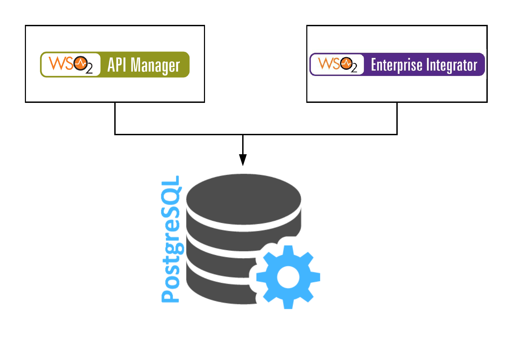

PlayBooks for Quick Setup for EI and APIM
=========
This Project include all the playbooks and roles related to Enterprise Integrator and API MAnager. Using serveral roles you can configure those products.


Architecture
------------



Requirements
------------
Only Requirment is Before you run the all nodes must have python. For that you can use following:

###### Ubuntu
```
sudo apt update -y
sudo apt install python-simplejson -y
```
###### RedHat/Amazon Linux
```
sudo yum update -y
sudo yum install python-simplejson -y
```
After this you have to Specify your Node inforamtions in invetory file.

PlayBook Variables
--------------
There are no Variables defined for Playbook. But there are variables defined in each roles.


Example Playbook
----------------

Including an example of how to use your PlayBook :

```yaml
  --- 
- hosts: api
  gather_facts: no
  become: true
  become_user: root
  vars_files:
    - vars/main.yml
  pre_tasks:
    - name: Setting the DB Private IP
      set_fact: db_ip="{{ hostvars[item]['ansible_enp0s8']['ipv4']['address'] }}"
      with_items:
        - "{{ groups['dbservers'] }}"
  roles:
      - Java8
      - APISetup
      - Jar
      - API_AllInOne_Config
```

License
-------


Author Information
------------------

This role was created in 2018 by [Iruka Avantha]